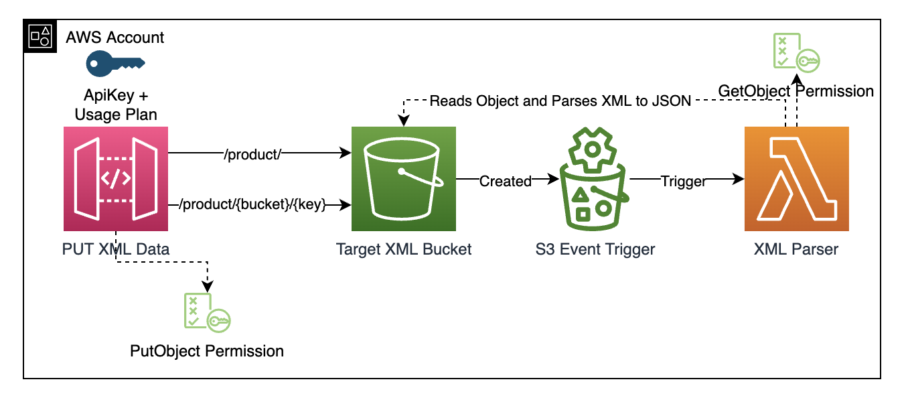

# Direct APIGW Integration with S3 on Object Creation



## Endpoints

There are two endpoints in this solution:

- **PUT /product/** - This endpoint configures the **bucket automatically** from the CDK stack and uses the `context.requestId` for the object Keys
- **PUT /product/{bucket}/{object}** - This endpoint allows the requestor to specify the bucket and object Key manually.

## Testing

### Endpoint 1 /product/

```
curl --location --request PUT 'https://{API_ID}.execute-api.eu-west-1.amazonaws.com/prod/product/' \
--header 'x-api-key: MyApiKeyThatIsAtLeast20Characters' \
--header 'Content-Type: application/xml' \
--data-raw '<Product>
    <AssetCrossReference Type="Primary Image"/>
    <AssetCrossReference Type="Image 02"/>
</Product>'
```

### Endpoint 2 /product/{bucket}/{object}

```
curl --location --request PUT 'https://{API_ID}.execute-api.eu-west-1.amazonaws.com/prod/product/rb-api-target-xml-bucket/p1234' \
--header 'Content-Type: application/xml' \
--header 'x-api-key: MyApiKeyThatIsAtLeast20Characters' \
--data-raw '<Product>
            <AssetCrossReference Type="Primary Image"/>
            <AssetCrossReference Type="Image 02"/>
        </Product>'
```

> Replace the bucket name also with the one you have created in the stack

## Useful commands

- `npm run build` compile typescript to js
- `npm run watch` watch for changes and compile
- `npm run test` perform the jest unit tests
- `cdk deploy` deploy this stack to your default AWS account/region
- `cdk diff` compare deployed stack with current state
- `cdk synth` emits the synthesized CloudFormation template
